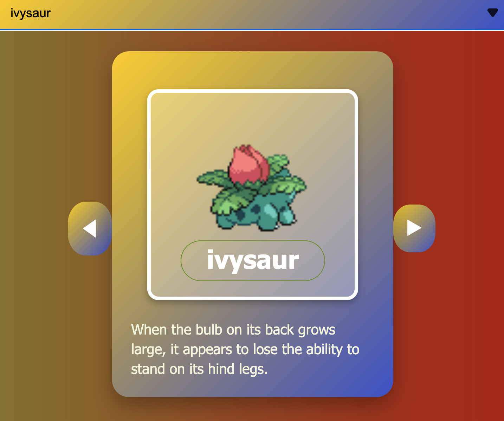
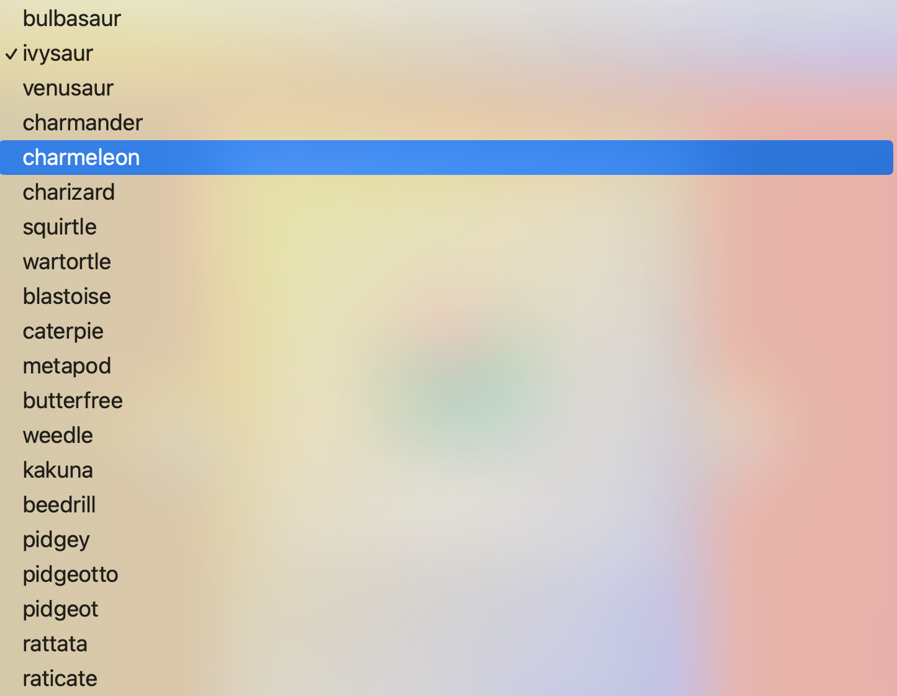

# PokémonDex

A simple Pokédex web application built with **React**.  
This project started as a **mock Front-End interview assignment** that I forked on [CodeSandbox](https://codesandbox.io/p/sandbox/i7clq). It became a fun way for me to relearn **data fetching in React** and practice state management, hooks, and styling.

---

## 🚀 Features

- 🎲 Display a **random Pokémon** on load
- 🔍 Browse and select Pokémon by name or ID
- 📜 Show Pokémon details including name, image, and description
- 🎨 Styled Pokémon cards with navigation buttons

---

## 🖼 Screenshots

### Main Pokémon Card



### Pokémon Select Menu



---

## 🛠 Tech Stack

- [React](https://reactjs.org/) (Hooks, useEffect, useState)
- Fetch API for data loading
- CSS for layout and styling

---

## 📦 Setup & Installation

Clone this repository:

```bash
git clone https://github.com/your-username/pokemondex.git
cd pokemondex
```

Install dependencies and start dev server

```bash
npm install
npm run dev
```

---

## 🌐 Live Demo

[Check out Pokémon characters on a Robot's face](https://vanillajs-reactpokemondex.onrender.com/)

## 🎯 Learning Outcomes

- Refreshed my knowledge on React hooks and conditional rendering

- Learned how to safely handle async data fetching

## 📌 Future Improvements

- Add search bar for Pokémon
- Better responsive layout and styling/ color principles
- Dark/light mode toggle

## License

This project is for learning purposes and not intended for production use. Pokémon and Pokémon character names are trademarks of @Nintendo, @Game Freak, and @Creatures.
